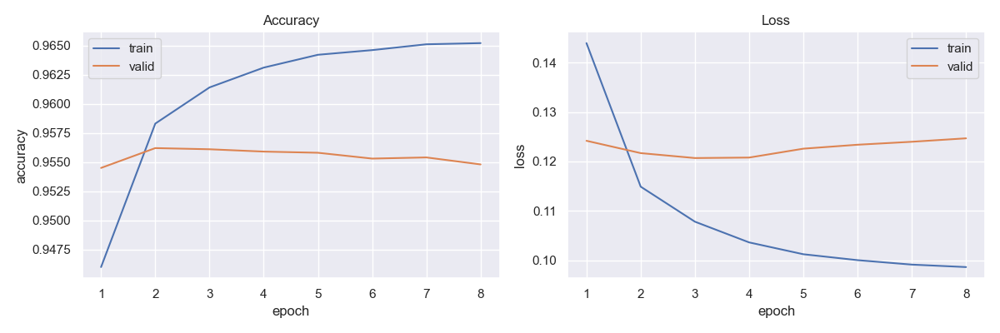
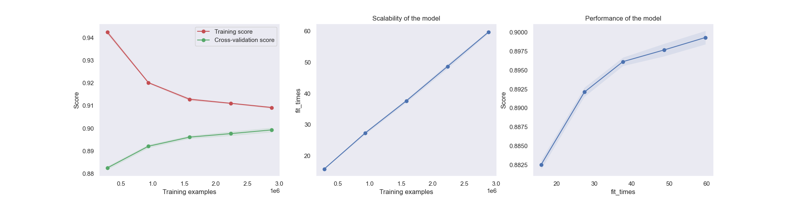

# Sentiment Analysis on Amazon Reviews

---

## Introduction

This project aims to classify Amazon reviews into one of **two categories**, using several type of machine learning 
algorithms, including Logistic Regression and LSTM deep recurrent neural networks. The model is trained on the **Amazon 
Review For Sentiment Analysis** dataset. This dataset consists of 4,000,000 string with **two labels** - positive or negative.

---

## Data Collection
There are several datasets publicly available for use in sentiment analysis. I decided to utilize the [Amazon 
Review For Sentiment Analysis](https://www.kaggle.com/datasets/bittlingmayer/amazonreviews) dataset. 

---

## Dependencies

* Python 3.8, [Tensorflow 2.8](https://www.tensorflow.org/), SKLearn, and NTLK.
* To install the required packages, run `pip install -r requirements.txt`.

---
## Early Results

* LSTM - 95.6% accuracy on validation set
  

* Logistic Regression - 90% accuracy on validation set

---
[//]: # (## Basic Training)

[//]: # ()
[//]: # (The repository is currently compatible with `tensorflow-2.8` and makes use of the Keras API using the `tensorflow.keras` library.)

[//]: # ()
[//]: # (* First, clone the repository and switch to the folder)

[//]: # ()
[//]: # (```bash)

[//]: # (git clone https://github.com/jeffreykthomas/emotion-recognition.git)

[//]: # (cd emotion-recognition)

[//]: # (```)

[//]: # (* If you want to train the first model, use:  )

[//]: # ()
[//]: # (```bash)

[//]: # (python3 -m training_models.emotion_recognition_training -size 128 --classes 8 --epochs 200)

[//]: # (```)

[//]: # ()
[//]: # (* The results I obtained from that training run are below:)

[//]: # ()
[//]: # (![epoch history]&#40;results/recognizer/128_reduced_False_augmented_False_8cat/epoch_history.png "Epoch History"&#41;)

[//]: # (![epoch history]&#40;results/recognizer/128_reduced_False_augmented_False_8cat/confusion_matrix.png "Epoch History"&#41;)

[//]: # (![epoch history]&#40;results/recognizer/128_reduced_False_augmented_False_8cat/performance_dist.png "Epoch History"&#41;)

[//]: # (![epoch history]&#40;results/recognizer/128_reduced_False_augmented_False_8cat/example_faces.png "Epoch History"&#41;)

[//]: # ()
[//]: # (## Training with GANs)

[//]: # (* Next, thinking of ways to improve the training, we explored the world of GANS. Within the [keras library of examples]&#40;https://keras.io/examples/generative&#41;, I tried to train an AdaGan, a StyleGan, and a DCGan. All had varying levels of effecitveness. But from those first attempts, the Conditional Gan produced the most realistic images of faces, that were somewhat representative of the emotion they were meant to portray. )

[//]: # (* To run training on the conditional gan with AffectNet, use:)

[//]: # ()
[//]: # (```bash)

[//]: # (python3 -m training_models.conditional_gan )

[//]: # (```)

[//]: # ()
[//]: # (While the images looked better than some of the other attempted GANs, the results weren't good enough representations to move the needle much for improving the emotion recognition model. Below are some examples of faces generated from a random latent variable:)

[//]: # ()
[//]: # (<div align="center">)

[//]: # (<table style="margin: 0 auto">)

[//]: # ()
[//]: # (<tr>)

[//]: # (<td style="text-align: center;">)

[//]: # ()
[//]: # (![epoch history]&#40;examples/conditional_gan/angry.png "Epoch History"&#41;)

[//]: # (<p style="margin-top: -15px;">Angry</p>)

[//]: # (</td>)

[//]: # (<td style="text-align: center;">)

[//]: # ()
[//]: # (![epoch history]&#40;examples/conditional_gan/disgust.png "Epoch History"&#41;)

[//]: # (<p style="margin-top: -15px;">Disgust</p>)

[//]: # (</td>)

[//]: # ()
[//]: # (<td style="text-align: center;">)

[//]: # ()
[//]: # (![epoch history]&#40;examples/conditional_gan/fear.png "Epoch History"&#41;)

[//]: # (<p style="margin-top: -15px;">Fear</p>)

[//]: # (</td>)

[//]: # ()
[//]: # (</tr>)

[//]: # (<tr>)

[//]: # (<td style="text-align: center;">)

[//]: # ()
[//]: # (![epoch history]&#40;examples/conditional_gan/happy.png "Epoch History"&#41;)

[//]: # (<p style="margin-top: -15px;">Happy</p>)

[//]: # (</td>)

[//]: # (<td style="text-align: center;">)

[//]: # ()
[//]: # (![epoch history]&#40;examples/conditional_gan/happy2.png "Epoch History"&#41;)

[//]: # (<p style="margin-top: -15px;">Happy</p>)

[//]: # (</td>)

[//]: # (<td style="text-align: center;">)

[//]: # ()
[//]: # (![epoch history]&#40;examples/conditional_gan/neutral.png "Epoch History"&#41;)

[//]: # (<p style="margin-top: -15px;">Neutral</p>)

[//]: # (</td>)

[//]: # (</tr>)

[//]: # ()
[//]: # (<tr>)

[//]: # (<td style="text-align: center;">)

[//]: # ()
[//]: # (![epoch history]&#40;examples/conditional_gan/neutral2.png "Epoch History"&#41;)

[//]: # (<p style="margin-top: -15px;">Neutral</p>)

[//]: # (</td>)

[//]: # (<td style="text-align: center;">)

[//]: # ()
[//]: # (![epoch history]&#40;examples/conditional_gan/sad.png "Epoch History"&#41;)

[//]: # (<p style="margin-top: -15px;">Sad</p>)

[//]: # (</td>)

[//]: # (<td style="text-align: center;">)

[//]: # ()
[//]: # (![epoch history]&#40;examples/conditional_gan/surprise.png "Epoch History"&#41;)

[//]: # (<p style="margin-top: -15px;">Surprise</p>)

[//]: # (</td>)

[//]: # (</tr>)

[//]: # ()
[//]: # (</table>)

[//]: # (</div>)

[//]: # ()
[//]: # (## The CycleGan)

[//]: # (* Ultimately, we found that a [Cycle Gan]&#40;https://keras.io/examples/generative/cyclegan/&#41; can be the most efficient to train and utilize for the purposes of increasing the accuracy of an emotion recognizer, with the added potential of increasing FER data.)

[//]: # (* To train the cycle gan, use:)

[//]: # ()
[//]: # (```bash)

[//]: # (python3 -m training_models.cyclegan --emotion1 'happiness' --emotion2 'sadness')

[//]: # (```)

[//]: # ()
[//]: # (* Some examples of images created using a cycle gan trained for several hundred epochs:)

[//]: # (<div align="center">)

[//]: # (<table style="margin: 0 auto">)

[//]: # (<tr>)

[//]: # (<th> Original </th>)

[//]: # (<th> Transformed </th>)

[//]: # (<th></th>)

[//]: # (<th> Original </th>)

[//]: # (<th> Transformed </th>)

[//]: # (</tr>)

[//]: # (<tr>)

[//]: # (<td style="text-align: center;">)

[//]: # ()
[//]: # (![epoch history]&#40;examples/AffectNet/232831.jpg "Epoch History"&#41;)

[//]: # (<p style="margin-top: -15px;">Neutral</p>)

[//]: # (</td>)

[//]: # (<td style="text-align: center;">)

[//]: # ()
[//]: # (![epoch history]&#40;examples/cyclegan/cyclegan_img_485.jpg "Epoch History"&#41;)

[//]: # (<p style="margin-top: -15px;">Angry</p>)

[//]: # (</td>)

[//]: # (<td></td>)

[//]: # (<td style="text-align: center;">)

[//]: # ()
[//]: # (![epoch history]&#40;examples/AffectNet/132527.jpg "Epoch History"&#41;)

[//]: # (<p style="margin-top: -15px;">Neutral</p>)

[//]: # (</td>)

[//]: # (<td style="text-align: center;">)

[//]: # ()
[//]: # (![epoch history]&#40;examples/cyclegan/cyclegan_img_1588.jpg "Epoch History"&#41;)

[//]: # (<p style="margin-top: -15px;">Angry</p>)

[//]: # (</td>)

[//]: # (</tr>)

[//]: # (<tr>)

[//]: # (<td style="text-align: center;">)

[//]: # ()
[//]: # (![epoch history]&#40;examples/AffectNet/51157.jpg "Epoch History"&#41;)

[//]: # (<p style="margin-top: -15px;">Happy</p>)

[//]: # (</td>)

[//]: # (<td style="text-align: center;">)

[//]: # ()
[//]: # (![epoch history]&#40;examples/cyclegan/cyclegan_img_6548.jpg "Epoch History"&#41;)

[//]: # (<p style="margin-top: -15px;">Contempt</p>)

[//]: # (</td>)

[//]: # (<td></td>)

[//]: # (<td style="text-align: center;">)

[//]: # ()
[//]: # (![epoch history]&#40;examples/AffectNet/272434.jpg "Epoch History"&#41;)

[//]: # (<p style="margin-top: -15px;">Happy</p>)

[//]: # (</td>)

[//]: # (<td style="text-align: center;">)

[//]: # ()
[//]: # (![epoch history]&#40;examples/cyclegan/cyclegan_img_8374.jpg "Epoch History"&#41;)

[//]: # (<p style="margin-top: -15px;">Contempt</p>)

[//]: # (</td>)

[//]: # (</tr>)

[//]: # (<tr>)

[//]: # (<td style="text-align: center;">)

[//]: # ()
[//]: # (![epoch history]&#40;examples/AffectNet/223519.jpg "Epoch History"&#41;)

[//]: # (<p style="margin-top: -15px;">Happy</p>)

[//]: # (</td>)

[//]: # (<td style="text-align: center;">)

[//]: # ()
[//]: # (![epoch history]&#40;examples/cyclegan/cyclegan_img_11071.jpg "Epoch History"&#41;)

[//]: # (<p style="margin-top: -15px;">Disgust</p>)

[//]: # (</td>)

[//]: # (<td></td>)

[//]: # (<td style="text-align: center;">)

[//]: # ()
[//]: # (![epoch history]&#40;examples/AffectNet/345273.jpg "Epoch History"&#41;)

[//]: # (<p style="margin-top: -15px;">Happy</p>)

[//]: # (</td>)

[//]: # (<td style="text-align: center;">)

[//]: # ()
[//]: # (![epoch history]&#40;examples/cyclegan/cyclegan_img_14119.jpg "Epoch History"&#41;)

[//]: # (<p style="margin-top: -15px;">Disgust</p>)

[//]: # (</td>)

[//]: # (</tr>)

[//]: # (<tr>)

[//]: # (<td style="text-align: center;">)

[//]: # ()
[//]: # (![epoch history]&#40;examples/AffectNet/176588.jpg "Epoch History"&#41;)

[//]: # (<p style="margin-top: -15px;">Happy</p>)

[//]: # (</td>)

[//]: # (<td style="text-align: center;">)

[//]: # ()
[//]: # (![epoch history]&#40;examples/cyclegan/cyclegan_img_16046.jpg "Epoch History"&#41;)

[//]: # (<p style="margin-top: -15px;">Fear</p>)

[//]: # (</td>)

[//]: # (<td></td>)

[//]: # (<td style="text-align: center;">)

[//]: # ()
[//]: # (![epoch history]&#40;examples/AffectNet/285321.jpg "Epoch History"&#41;)

[//]: # (<p style="margin-top: -15px;">Happy</p>)

[//]: # (</td>)

[//]: # (<td style="text-align: center;">)

[//]: # ()
[//]: # (![epoch history]&#40;examples/cyclegan/cyclegan_img_16868.jpg "Epoch History"&#41;)

[//]: # (<p style="margin-top: -15px;">Fear</p>)

[//]: # (</td>)

[//]: # (</tr>)

[//]: # ()
[//]: # (<tr>)

[//]: # (<td style="text-align: center;">)

[//]: # ()
[//]: # (![epoch history]&#40;examples/AffectNet/128806.jpg "Epoch History"&#41;)

[//]: # (<p style="margin-top: -15px;">Sad</p>)

[//]: # (</td>)

[//]: # (<td style="text-align: center;">)

[//]: # ()
[//]: # (![epoch history]&#40;examples/cyclegan/cyclegan_img_20093.jpg "Epoch History"&#41;)

[//]: # (<p style="margin-top: -15px;">Happy</p>)

[//]: # (</td>)

[//]: # (<td></td>)

[//]: # (<td style="text-align: center;">)

[//]: # ()
[//]: # (![epoch history]&#40;examples/AffectNet/366876.jpg "Epoch History"&#41;)

[//]: # (<p style="margin-top: -15px;">Sad</p>)

[//]: # (</td>)

[//]: # (<td style="text-align: center;">)

[//]: # ()
[//]: # (![epoch history]&#40;examples/cyclegan/cyclegan_img_23720.jpg "Epoch History"&#41;)

[//]: # (<p style="margin-top: -15px;">Happy</p>)

[//]: # (</td>)

[//]: # (</tr>)

[//]: # (<tr>)

[//]: # (<td style="text-align: center;">)

[//]: # ()
[//]: # (![epoch history]&#40;examples/AffectNet/211543.jpg "Epoch History"&#41;)

[//]: # (<p style="margin-top: -15px;">Anger</p>)

[//]: # (</td>)

[//]: # (<td style="text-align: center;">)

[//]: # ()
[//]: # (![epoch history]&#40;examples/cyclegan/cyclegan_img_26842.jpg "Epoch History"&#41;)

[//]: # (<p style="margin-top: -15px;">Neutral</p>)

[//]: # (</td>)

[//]: # (<td></td>)

[//]: # (<td style="text-align: center;">)

[//]: # ()
[//]: # (![epoch history]&#40;examples/AffectNet/268708.jpg "Epoch History"&#41;)

[//]: # (<p style="margin-top: -15px;">Anger</p>)

[//]: # (</td>)

[//]: # (<td style="text-align: center;">)

[//]: # ()
[//]: # (![epoch history]&#40;examples/cyclegan/cyclegan_img_28396.jpg "Epoch History"&#41;)

[//]: # (<p style="margin-top: -15px;">Neutral</p>)

[//]: # (</td>)

[//]: # (</tr>)

[//]: # (<tr>)

[//]: # (<td style="text-align: center;">)

[//]: # ()
[//]: # (![epoch history]&#40;examples/AffectNet/366327.jpg "Epoch History"&#41;)

[//]: # (<p style="margin-top: -15px;">Happy</p>)

[//]: # (</td>)

[//]: # (<td style="text-align: center;">)

[//]: # ()
[//]: # (![epoch history]&#40;examples/cyclegan/cyclegan_img_33151.jpg "Epoch History"&#41;)

[//]: # (<p style="margin-top: -15px;">Sad</p>)

[//]: # (</td>)

[//]: # (<td></td>)

[//]: # (<td style="text-align: center;">)

[//]: # ()
[//]: # (![epoch history]&#40;examples/AffectNet/61916.jpg "Epoch History"&#41;)

[//]: # (<p style="margin-top: -15px;">Happy</p>)

[//]: # (</td>)

[//]: # (<td style="text-align: center;">)

[//]: # ()
[//]: # (![epoch history]&#40;examples/cyclegan/cyclegan_img_31226.jpg "Epoch History"&#41;)

[//]: # (<p style="margin-top: -15px;">Sad</p>)

[//]: # (</td>)

[//]: # (</tr>)

[//]: # (<tr>)

[//]: # (<td style="text-align: center;">)

[//]: # ()
[//]: # (![epoch history]&#40;examples/AffectNet/397888.jpg "Epoch History"&#41;)

[//]: # (<p style="margin-top: -15px;">Neutral</p>)

[//]: # (</td>)

[//]: # (<td style="text-align: center;">)

[//]: # ()
[//]: # (![epoch history]&#40;examples/cyclegan/cyclegan_img_37874.jpg "Epoch History"&#41;)

[//]: # (<p style="margin-top: -15px;">Surprise</p>)

[//]: # (</td>)

[//]: # (<td></td>)

[//]: # (<td style="text-align: center;">)

[//]: # ()
[//]: # (![epoch history]&#40;examples/AffectNet/202886.jpg "Epoch History"&#41;)

[//]: # (<p style="margin-top: -15px;">Neutral</p>)

[//]: # (</td>)

[//]: # (<td style="text-align: center;">)

[//]: # ()
[//]: # (![epoch history]&#40;examples/cyclegan/cyclegan_img_37188.jpg "Epoch History"&#41;)

[//]: # (<p style="margin-top: -15px;">Surprise</p>)

[//]: # (</td>)

[//]: # (</tr>)

[//]: # (</table>)

[//]: # (</div>)

[//]: # ()
[//]: # (* Using the emotion recognition model to predict the emotions of the generated cyclegan images showed that they were classified correctly at a high rate:)

[//]: # ()
[//]: # (![epoch history]&#40;results/cyclegan/image_analysis/confusion_matrix.png "Epoch History"&#41;)

[//]: # ()
[//]: # ()
[//]: # (* One thing I noticed during that process is that if the label for an image seemed somewhat ambiguous, the resulting generated image would be transformed a lot less &#40;it would look a lot like the original&#41;.)

[//]: # ()
[//]: # (<div align="center">)

[//]: # (<table style="margin: 0 auto">)

[//]: # (<tr>)

[//]: # (<th> Original </th>)

[//]: # (<th> Transformed </th>)

[//]: # (<th></th>)

[//]: # (<th> Original </th>)

[//]: # (<th> Transformed </th>)

[//]: # (</tr>)

[//]: # ()
[//]: # (<tr>)

[//]: # (<td style="text-align: center;">)

[//]: # ()
[//]: # (![epoch history]&#40;examples/AffectNet/380107.jpg "Epoch History"&#41;)

[//]: # (<p style="margin-top: -15px;">Happy</p>)

[//]: # (</td>)

[//]: # (<td style="text-align: center;">)

[//]: # ()
[//]: # (![epoch history]&#40;examples/cyclegan/cyclegan_img_13685.jpg "Epoch History"&#41;)

[//]: # (<p style="margin-top: -15px;">Disgust</p>)

[//]: # (</td>)

[//]: # (<td></td>)

[//]: # (<td style="text-align: center;">)

[//]: # ()
[//]: # (![epoch history]&#40;examples/AffectNet/407233.jpg "Epoch History"&#41;)

[//]: # (<p style="margin-top: -15px;">Neutral</p>)

[//]: # (</td>)

[//]: # (<td style="text-align: center;">)

[//]: # ()
[//]: # (![epoch history]&#40;examples/cyclegan/cyclegan_img_8872.jpg "Epoch History"&#41;)

[//]: # (<p style="margin-top: -15px;">Anger</p>)

[//]: # (</td>)

[//]: # (</tr>)

[//]: # (<tr>)

[//]: # (<td style="text-align: center;">)

[//]: # ()
[//]: # (![epoch history]&#40;examples/AffectNet/287655.jpg "Epoch History"&#41;)

[//]: # (<p style="margin-top: -15px;">Neutral</p>)

[//]: # (</td>)

[//]: # (<td style="text-align: center;">)

[//]: # ()
[//]: # (![epoch history]&#40;examples/cyclegan/cyclegan_img_37290.jpg "Epoch History"&#41;)

[//]: # (<p style="margin-top: -15px;">Surprise</p>)

[//]: # (</td>)

[//]: # (<td></td>)

[//]: # (<td style="text-align: center;">)

[//]: # ()
[//]: # (![epoch history]&#40;examples/AffectNet/30393.jpg "Epoch History"&#41;)

[//]: # (<p style="margin-top: -15px;">Happy</p>)

[//]: # (</td>)

[//]: # (<td style="text-align: center;">)

[//]: # ()
[//]: # (![epoch history]&#40;examples/cyclegan/cyclegan_img_32259.jpg "Epoch History"&#41;)

[//]: # (<p style="margin-top: -15px;">Sad</p>)

[//]: # (</td>)

[//]: # (</tr>)

[//]: # ()
[//]: # (</table>)

[//]: # (</div>)

[//]: # ()
[//]: # (## Choosing the best GAN training weights)

[//]: # (* During my training runs I saved the weights at the end of each epoch. To find the best weights for each run, I used the emotion recognizer model to find which weights produced the hightest percentage results for the transformed images. To replicate, run:)

[//]: # ()
[//]: # (```bash)

[//]: # (python3 -m eval_tools.eval_gan_performance)

[//]: # (```)

[//]: # ()
[//]: # (## Look for ambiguous Labels)

[//]: # (* Using the hypothesis that the cycle gan doesn't transform ambiguously labeled images as much, to use the trained gan models to look for images with ambiguous labels, run:)

[//]: # (```bash)

[//]: # (python3 -m eval_tools.eval_image_transformation)

[//]: # (```)

[//]: # (* This script uses the structural similarity module from skimage.metrics to check how similar an image is to its transformed image. I ended up using a threshold of 0.85 as the measure of structural similarity needed to be in order to be classified as 'ambiguous'.)

[//]: # (## Training with ambiguous labels filtered out)

[//]: # ()
[//]: # (* To train the recognizer model with only images classified as not 'ambiguous', run:)

[//]: # (```bash)

[//]: # (python3 -m training_models.emotion_recognition_training -size 128 --classes 8 --epochs 200 --reduced True)

[//]: # (```)

[//]: # (* The results I obtained from that training run are below, close to 3% higher accuracy on the validation set:)

[//]: # ()
[//]: # (![epoch history]&#40;results/recognizer/128_reduced_True_augmented_False_8cat/epoch_history.png "Epoch History"&#41;)

[//]: # (![epoch history]&#40;results/recognizer/128_reduced_True_augmented_False_8cat/confusion_matrix.png "Epoch History"&#41;)

[//]: # (![epoch history]&#40;results/recognizer/128_reduced_True_augmented_False_8cat/performance_dist.png "Epoch History"&#41;)

[//]: # (![epoch history]&#40;results/recognizer/128_reduced_True_augmented_False_8cat/example_faces.png "Epoch History"&#41;)

[//]: # ()
[//]: # (* The results using the ambiguous filter for 7 classes was even higher, 67%, which is higher than the state-of-the-art models [reported here]&#40;https://paperswithcode.com/sota/facial-expression-recognition-on-affectnet&#41;.)

[//]: # ()
[//]: # (![epoch history]&#40;results/recognizer/128_reduced_True_augmented_False_7cat/epoch_history.png "Epoch History"&#41;)

[//]: # (![epoch history]&#40;results/recognizer/128_reduced_True_augmented_False_7cat/confusion_matrix.png "Epoch History"&#41;)

[//]: # (## Training with ambiguous labels filtered out & additional generated images)

[//]: # ()
[//]: # (* To train the recognizer model with non 'ambiguous' original images, plus 20,000 generated images, run:)

[//]: # (```bash)

[//]: # (python3 -m training_models.emotion_recognition_training -size 128 --classes 8 --epochs 200 --reduced True --augmented True)

[//]: # (```)

[//]: # (* The results I obtained from that training run are below, and accuracy of 62.15%, an additional 2% higher accuracy on the validation set, for a total of 5%, when compared to the original training run. This result is just slightly off the highest report of 62.425% &#40;though I also filtered ambiguous images out of the validation set&#41;:)

[//]: # ()
[//]: # (![epoch history]&#40;results/recognizer/128_reduced_True_augmented_True_8cat/epoch_history.png "Epoch History"&#41;)

[//]: # (![epoch history]&#40;results/recognizer/128_reduced_True_augmented_True_8cat/confusion_matrix.png "Epoch History"&#41;)

[//]: # (![epoch history]&#40;results/recognizer/128_reduced_True_augmented_True_8cat/performance_dist.png "Epoch History"&#41;)

[//]: # (![epoch history]&#40;results/recognizer/128_reduced_True_augmented_True_8cat/example_faces.png "Epoch History"&#41;)

[//]: # ()
[//]: # (## Web App Production Pipeline)

[//]: # ()
[//]: # (Once the best weights have been identified, use the following steps to prepare to deploy the models. To skip the training steps, [go here]&#40;https://drive.google.com/file/d/13IPttGQbn06Upkdh51IBqjmLGve7ZFx8/view?usp=sharing&#41; to download weights from my training, plus the face detection weights, and move them to the `public` folder of the web app.)

[//]: # (* If you're using your own training weights, run the following code to prepare the models for the web:)

[//]: # (```bash)

[//]: # (python3 -m production_pipeline.convert_weights_to_js_model)

[//]: # (```)

[//]: # ()
[//]: # ()
[//]: # (* There are many options for running and hosting websites. For this project, I used Vue 3 as the framework for the app, and firebase for hosting. If you want to use Vue, start a project by following the steps [here]&#40;'https://cli.vuejs.org/guide/creating-a-project.html'&#41;)

[//]: # ()
[//]: # (```bash)

[//]: # (npm install -g @vue/cli)

[//]: # (```)

[//]: # ()
[//]: # (* Then, in the appropriate folder, choosing the default vue3 options:)

[//]: # ()
[//]: # (```bash)

[//]: # (vue create web-app)

[//]: # (```)

[//]: # ()
[//]: # (* Lastly, for the style dependency, by [mdbootstrap]&#40;https://mdbootstrap.com/&#41;, and the [package containing tensorflow and face detection]&#40;https://github.com/vladmandic/face-api&#41; &#40;vladmandic package includes an updated version of tensorflowjs, whereas the main fork does not&#41; install the following in the web-app root directory:)

[//]: # ()
[//]: # (```bash)

[//]: # (vue add mdb5)

[//]: # (npm i @vladmandic/face-api )

[//]: # (```)

[//]: # ()
[//]: # (* Then copy component `App.vue` and `main.js` in the `src` folder, and `EmotionRecognition.vue`, `Index.vue`, into the `components` folder of you project and run:)

[//]: # (```bash)

[//]: # (npm run serve )

[//]: # (```)

[//]: # ()
[//]: # (* The running app is located at [emotiondetection.app]&#40;https://emotiondetection.app&#41;)

## References
* [Chollet, F. - Bidirectional LSTM on IMDB](https://keras.io/examples/nlp/bidirectional_lstm_imdb/)
