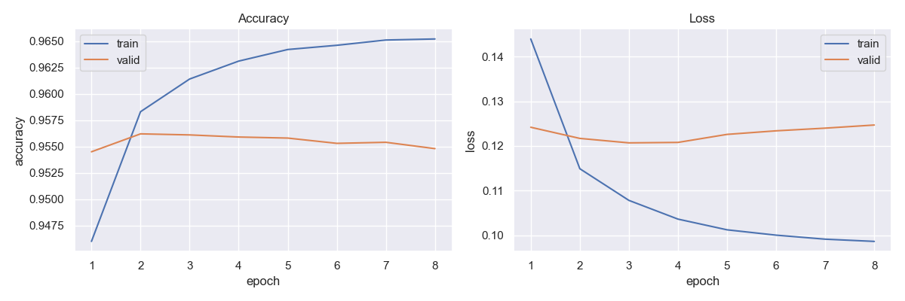
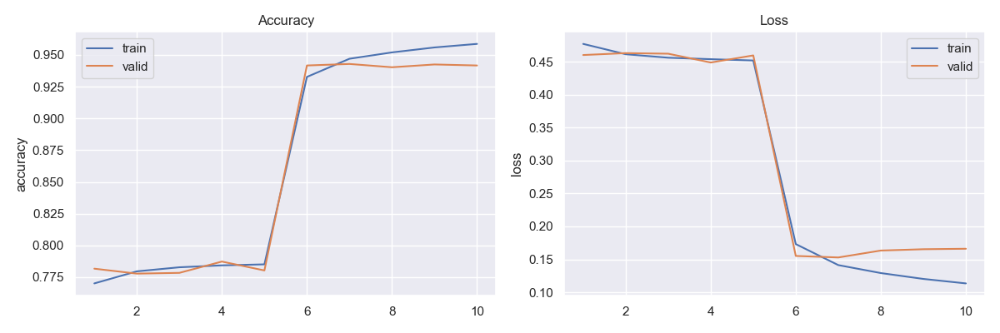

# Sentiment Analysis on Amazon Reviews

---

## Introduction

This project aims to classify Amazon reviews into one of **two categories**, using several type of machine learning 
algorithms, including Logistic Regression and LSTM deep recurrent neural networks. The model is trained on the **Amazon 
Review For Sentiment Analysis** dataset. This dataset consists of 4,000,000 string with **two labels** - positive or negative.

---

## Data Collection
There are several datasets publicly available for use in sentiment analysis. I decided to utilize the [Amazon 
Review For Sentiment Analysis](https://www.kaggle.com/datasets/bittlingmayer/amazonreviews) dataset. 

---

## Dependencies

* Python 3.8, [Tensorflow 2.8](https://www.tensorflow.org/), SKLearn, and NTLK.
* To install the required packages, run `pip install -r requirements.txt`.

---
## Results

* LSTM - 95.6% accuracy on validation set
  

* MSM BERT - 94.2% accuracy on validation set

* Logistic Regression - 90% accuracy on validation set

---

## Paper discussing results
* [Sentiment Analysis on Amazon Reviews](https://docs.google.com/document/d/1dXUQishbi1LZOsuqpGc-Jp2hXqyAZFVr7caLf_EWVrE/edit?usp=sharing)

## Model Deployment
* [www.emotiondetection.app/sentiment](https://emotiondetection.app/sentiment)

## References
* [Chollet, F. - Bidirectional LSTM on IMDB](https://keras.io/examples/nlp/bidirectional_lstm_imdb/)
* [Singh, A. - End-to-end Masked Language Modeling with BERT](https://keras.io/examples/nlp/masked_language_modeling/)
